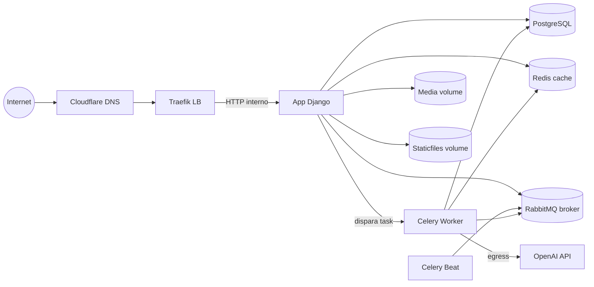
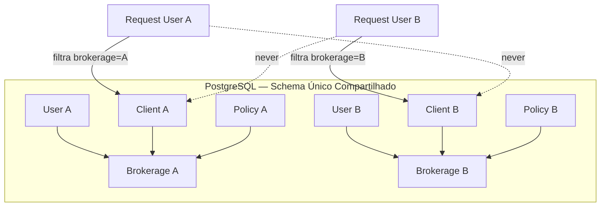
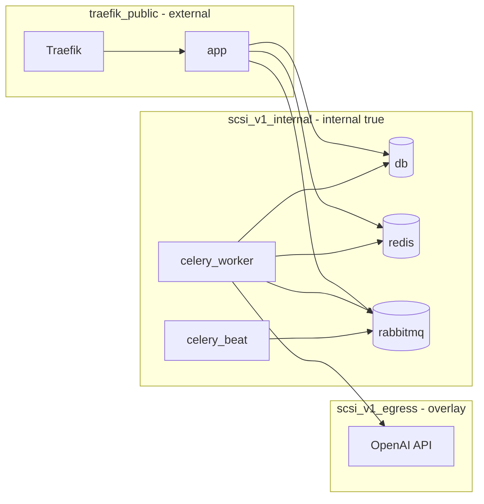

# PRD — SCSI: Sistema de Gestão para Corretora de Seguros Inteligente

> **Domínio principal:** `scsi.digital`
> **Stack:** Python > 3.13 · Django > 6.0 · PostgreSQL · Celery · RabbitMQ · Redis · LangChain > 1.0 · LangGraph · OpenAI (GPT-5.5-mini) · Docker · Docker Swarm · Traefik · Cloudflare DNS · Let's Encrypt wildcard TLS (DNS-01).
> **Idioma do código:** Inglês. **Idioma da interface:** Português brasileiro. **Timezone:** `America/Sao_Paulo`.

---

## 1. Visão Geral

O **SCSI — Sistema de Gestão para Corretora de Seguros Inteligente** é uma plataforma SaaS multi-tenant que permite que múltiplas corretoras de seguros operem sobre a mesma instância da aplicação, com isolamento lógico rigoroso de dados, usuários, arquivos, permissões, clientes, propostas, apólices, sinistros, renovações, negociações, comissões, relatórios e agentes de IA.

Cada corretora (tenant) enxerga o sistema como se fosse exclusivo seu. Usuários, arquivos e registros de uma corretora jamais podem aparecer para usuários de outra corretora.

O sistema combina gestão operacional de corretora (CRM, propostas, apólices, sinistros, comissões, renovações, relatórios) com **Inteligência Artificial Assistida** via agentes construídos em LangChain/LangGraph, capazes de resumir entidades e responder perguntas com base nos dados da corretora do usuário autenticado — sempre respeitando o isolamento multi-tenant.

A entrega é containerizada com Docker, desenvolvida localmente com Docker Compose e deployada em produção com Docker Swarm em VPS Ubuntu, atrás de Traefik com TLS wildcard emitido por Let's Encrypt via challenge DNS-01 com Cloudflare.

---

## 2. Objetivos do Produto

1. Centralizar a operação de corretoras de seguros em um único sistema SaaS multi-tenant.
2. Garantir isolamento absoluto de dados entre corretoras (tenants) via arquitetura compartilhada com campos-chave.
3. Automatizar fluxos de propostas, apólices, sinistros, renovações, endossos e comissões.
4. Oferecer um CRM visual com pipeline Kanban personalizável para negociações.
5. Fornecer dashboards com métricas, gráficos e insights da carteira.
6. Disponibilizar relatórios exportáveis em PDF e CSV.
7. Integrar agentes de IA (LangChain/LangGraph) para resumos de entidades e chat contextual com tools de leitura da base do tenant.
8. Processar tarefas pesadas de IA de forma assíncrona via Celery, sem bloquear a interface.
9. Proteger arquivos privados (media) contra acesso público e cross-tenant.
10. Entregar deploy resiliente, com healthchecks, restart policies, rollout sem downtime e rollback automático.

---

## 3. Público-Alvo

- **Corretoras de seguros** de pequeno e médio porte que precisam de gestão operacional e CRM.
- **Corretores autônomos** que operam como agentes ou produtores vinculados a uma corretora.
- **Equipes comerciais** que precisam de pipeline visual de negociações (Kanban).
- **Gestores/administradores** de corretora que precisam de dashboards, relatórios e controle de comissões/repasses.

---

## 4. Problemas que o Sistema Resolve

- Fragmentação de dados de clientes, apólices e sinistros em planilhas e sistemas isolados.
- Dificuldade de acompanhamento de renovações e vencimentos.
- Falta de visão de funil de negociações (leads → propostas → apólices).
- Cálculo manual de comissões e repasses entre corretora, agentes e produtores.
- Ausência de resumos inteligentes e contextualizados por entidade.
- Exposição indevida de documentos sensíveis de clientes.
- Falta de relatórios padronizados em PDF/CSV para gestão e prestação de contas.
- Dificuldade de escalar a operação de múltiplas corretoras sem isolamento de dados.

---

## 5. Escopo do Produto

- Plataforma SaaS multi-tenant compartilhada.
- Cadastro de corretora com CNPJ e plano (free inicialmente).
- Landing page institucional com planos (apenas free habilitado).
- Autenticação por email com recuperação de senha nativa do Django.
- Gestão de usuários, permissões e hierarquia (dono/admin, agentes, produtores).
- Gestão de clientes, seguradoras, ramos, coberturas, itens cobertos.
- Propostas de seguro com geração automática de apólice.
- Apólices, endossos, sinistros e anexos privados.
- Renovações com controle de vencimento e status.
- CRM com grid e Kanban personalizável.
- Agentes, produtores, comissões e repasses.
- Dashboard com métricas, gráficos e funil de negociações.
- Relatórios em PDF e CSV.
- Agentes de IA: resumos de cliente, apólice, sinistro, proposta e negociação.
- Chat com IA com sessões salvas por usuário, resposta em stream e Markdown.
- Tarefas assíncronas com Celery + RabbitMQ + Redis.
- Notificações internas na interface ao concluir tasks de IA.
- Admin Django com filtros, buscas e respeito ao tenant.
- Dados fake via Django command para demonstração.
- Documentação com MKDocs (suporte a Mermaid).
- Deploy local com Docker Compose.
- Deploy em produção com Docker Swarm, Traefik, TLS wildcard via DNS-01.
- Scripts de deploy e backup.

---

## 6. Fora de Escopo Inicial

- Integração real de pagamentos / gateways (planos fictícios; apenas free habilitado).
- Integração com APIs externas de seguradoras (não solicitado).
- Aplicativo mobile nativo (a UI é responsiva web).
- Schemas/bancos separados por tenant (arquitetura é compartilhada).
- Testes automatizados (requisito explícito: não implementar testes).
- App de mensageria entre usuários (chat entre corretores).
- Module / Video / Mindmap do NotebookLM (não aplicável a este stack).
- Migração automática de dados de sistemas legados de terceiros.

---

## 7. Personas e Perfis de Usuário

| Perfil | Descrição | Permissões |
|---|---|---|
| **Dono / Administrador da corretora** | Responsável pela corretora (tenant). Cadastra a conta e gerencia tudo. | Acesso total ao tenant: usuários, agentes, produtores, comissões, relatórios, configurações do CRM. |
| **Agente** | Pessoa ou empresa parceira que vende seguros para a corretora. Pode ter vários produtores. | Acesso aos seus clientes, propostas, apólices, sinistros, negociações e comissões repassadas. |
| **Produtor** | Corretor final. Pode trabalhar para um agente ou diretamente para a corretora. | Acesso aos seus clientes, propostas, apólices, sinistros, negociações e suas comissões. |
| **Usuário operacional** | Usuário de backoffice sem vínculo comercial. | Acesso conforme perfil/permissoes atribuídas pelo admin do tenant. |

> Todo usuário é sempre vinculado a exatamente uma corretora (tenant). Não existem usuários globais exceto superusuários do Django (acesso restrito ao admin).

---

## 8. Visão Funcional do Sistema

O SCSI é organizado em grandes blocos funcionais:

1. **Conta & Onboarding:** Landing page → criar conta (corretora + usuário admin) → escolha de plano (free) → login por email.
2. **Cadastro Base:** Clientes, seguradoras, ramos, coberturas, itens cobertos.
3. **Comercial:** Propostas → geração de apólice → apólices → endossos.
4. **Sinistros:** Sinistros vinculados a apólice + item coberto + anexos.
5. **CRM:** Negociações com pipeline Kanban personalizável e visão grid.
6. **Pós-venda:** Renovações com vencimentos e status.
7. **Financeiro:** Comissões da corretora, agentes e produtores com repasses.
8. **Inteligência:** Resumos por IA + chat com IA contextual ao tenant.
9. **Gestão:** Dashboard, relatórios PDF/CSV, admin Django.
10. **Operação:** Tarefas assíncronas (Celery), notificações internas, healthchecks, deploy.

---

## 9. Requisitos Funcionais

### 9.1 Usuários e Autenticação

- **RF-01:** Gestão e cadastro de usuários vinculados a uma corretora.
- **RF-02:** Autenticação por **email** (não username).
- **RF-03:** Uso do sistema nativo de usuários e autenticação do Django.
- **RF-04:** Recuperação de senha por email usando recursos nativos do Django.
- **RF-05:** Permissões por perfil (dono/admin, agente, produtor, operacional).
- **RF-06:** Todo usuário pertence a exatamente uma corretora.

### 9.2 Cadastro de Corretora

- **RF-10:** Cadastro da corretora durante a criação de conta.
- **RF-11:** CNPJ obrigatório.
- **RF-12:** Razão Social obrigatória.
- **RF-13:** Demais dados cadastrais opcionais.
- **RF-14:** Escolha de plano na criação da conta.
- **RF-15:** Apenas o plano **free** disponível inicialmente.

### 9.3 Landing Page e Planos

- **RF-20:** Landing page principal na raiz (`scsi.digital`).
- **RF-21:** Apresentação do sistema e CTAs para criar conta e login.
- **RF-22:** Planos exibidos são fictícios inicialmente.
- **RF-23:** Apenas o botão do plano free habilitado.
- **RF-24:** Botões dos demais planos exibem "em breve" e ficam desabilitados.
- **RF-25:** Nenhuma integração de pagamento.

### 9.4 Entidades Centrais

- **RF-30:** Gestão de **Clientes** (propostas, apólices, sinistros, anexos, negociações).
- **RF-31:** Gestão de **Seguradoras** (relacionadas a propostas, apólices, ramos).
- **RF-32:** Gestão de **Ramos** (auto, residencial, vida, viagem, empresarial, frota, outros).
- **RF-33:** Gestão de **Coberturas**.
- **RF-34:** Gestão de **Itens Cobertos** (objeto segurado: automóvel, casa, frota, viagem, vida, item empresarial).
- **RF-35:** Gestão de **Propostas**.
- **RF-36:** Gestão de **Apólices**.
- **RF-37:** Gestão de **Sinistros**.
- **RF-38:** Gestão de **Anexos** (clientes, propostas, apólices, sinistros).
- **RF-39:** Gestão de **Renovações**.
- **RF-40:** Gestão de **Endossos** (relacionados a apólices).
- **RF-41:** Gestão de **Agentes**.
- **RF-42:** Gestão de **Produtores**.
- **RF-43:** Gestão de **Comissões** (corretora, agentes, produtores).
- **RF-44:** Gestão de **Negociações CRM**.

### 9.5 Propostas e Apólices

- **RF-50:** Uma proposta deve poder gerar uma apólice.
- **RF-51:** Botão "Gerar apólice" na proposta cria automaticamente a apólice com base nos dados da proposta.
- **RF-52:** Propostas e apólices devem ter **itens cobertos** (1:N).
- **RF-53:** Propostas e apólices devem ter **coberturas** associadas.

### 9.6 Itens Cobertos

- **RF-60:** Item coberto representa o objeto segurado.
- **RF-61:** Item coberto relaciona-se com propostas e apólices.
- **RF-62:** Um sinistro sempre é em cima de um item coberto por uma apólice.

### 9.7 Sinistros

- **RF-70:** Sinistro vinculado a uma apólice.
- **RF-71:** Sinistro vinculado a um item coberto.
- **RF-72:** Sinistro permite anexos.
- **RF-73:** Sinistro permite resumo com IA.

### 9.8 Anexos

- **RF-80:** Anexos em clientes, propostas, apólices e sinistros.
- **RF-81:** Diversos formatos de arquivos aceitos.
- **RF-82:** Arquivos privados — acesso apenas a usuários autorizados da corretora correta.

### 9.9 Renovações

- **RF-90:** Gestão de renovações de seguros.
- **RF-91:** Controle de vencimentos.
- **RF-92:** Indicação de status da renovação.
- **RF-93:** Relatórios e alertas relacionados a renovações.

### 9.10 CRM

- **RF-100:** Painel CRM para controle de negociações.
- **RF-101:** Visualização em **grid**.
- **RF-102:** Visualização em **kanban**.
- **RF-103:** Pipeline Kanban personalizável.
- **RF-104:** Etapas com nome personalizável.
- **RF-105:** Etapas com cores personalizáveis.
- **RF-106:** Cards arrastáveis entre etapas.
- **RF-107:** Negociações podem ser resumidas com IA.

### 9.11 Agentes, Produtores e Comissões

- **RF-110:** Gestão de agentes (pessoa ou empresa parceira).
- **RF-111:** Gestão de produtores (corretores finais).
- **RF-112:** Um agente pode ter vários produtores.
- **RF-113:** Uma corretora pode ter vários agentes.
- **RF-114:** Comissão paga à corretora; corretora repassa a agentes e produtores.
- **RF-115:** Cálculo de repasses.
- **RF-116:** Relatórios de comissões e repasses.

### 9.12 Dashboard

- **RF-120:** Dashboard com visão geral e métricas da corretora.
- **RF-121:** Métricas de carteira de clientes, seguros, seguradoras e valores.
- **RF-122:** Insights.
- **RF-123:** Diversos gráficos.
- **RF-124:** Gráfico de **funil de negociações/leads** com níveis.

### 9.13 Relatórios

- **RF-130:** Menu e tela dedicada a relatórios.
- **RF-131:** Exportação em **PDF** (ReportLab/PyPDF).
- **RF-132:** Exportação em **CSV**.
- **RF-133:** Relatórios de clientes, seguros, seguradoras, apólices, propostas, sinistros, renovações, comissões e carteira.

### 9.14 Inteligência Artificial

- **RF-140:** Botão "Resumir com IA" em: cliente, apólice, sinistro, proposta e negociação.
- **RF-141:** Ao clicar, dispara agente de IA (Celery) com tools de acesso à base do tenant.
- **RF-142:** O agente busca registros relacionados à entidade no tenant do usuário.
- **RF-143:** Resumo gerado com insights e salvo em campo de texto da entidade.
- **RF-144:** Interface exibe loading no botão + aviso de notificação ao concluir.
- **RF-145:** Notificação interna ao finalizar a task.
- **RF-146:** Tela de **Chat com IA** no menu lateral.
- **RF-147:** Usuário cria sessões de chat salvas por usuário.
- **RF-148:** Agente do chat tem tools de acesso à base da corretora (respeitando tenant).
- **RF-149:** Resposta com efeito **stream**.
- **RF-150:** Resposta em **Markdown**.
- **RF-151:** Template renderiza Markdown em HTML com segurança.

### 9.15 Admin Django

- **RF-160:** Admin gerencia todas as entidades.
- **RF-161:** Filtros e buscas no admin.
- **RF-162:** Admin respeita tenant e permissões quando aplicável.

### 9.16 Notificações Internas

- **RF-170:** Notificações internas na interface ao concluir tarefas assíncronas (ex.: resumo de IA pronto).

---

## 10. Requisitos Não Funcionais

### 10.1 Responsividade

- **RNF-01:** Sistema responsivo em todas as dimensões de tela.

### 10.2 Segurança

- **RNF-10:** Não expor dados sensíveis.
- **RNF-11:** Rotas protegidas por autenticação e permissão.
- **RNF-12:** Filtros multi-tenant obrigatórios em queries sensíveis.
- **RNF-13:** Media privada visível apenas a usuários com permissão.
- **RNF-14:** Segredos de produção não versionados.

### 10.3 Performance

- **RNF-20:** Filtros, telas e processos com ótimo desempenho.
- **RNF-21:** Nada pesado bloqueia request/response.
- **RNF-22:** Processamentos demorados vão para Celery.

### 10.4 UX

- **RNF-30:** UI/UX excelente, baseada no design system.
- **RNF-31:** Jornadas fluidas.
- **RNF-32:** Bom contraste de elementos, fontes e fundo.
- **RNF-33:** Feedback visual para ações assíncronas (loading, notificações).

### 10.5 Deploy Resiliente

- **RNF-40:** Healthchecks em todos os serviços.
- **RNF-41:** Restart policies em todos os serviços.
- **RNF-42:** Limites e reservas de CPU/memória.
- **RNF-43:** App atualiza sem downtime (`order: start-first`, `failure_action: rollback`).
- **RNF-44:** Rollback automático em falha de healthcheck.
- **RNF-45:** Nenhum serviço entra em crash-loop por dependência não pronta (entrypoints com `wait_for_db`).

### 10.6 Disponibilidade e Observabilidade

- **RNF-50:** Logs estruturados por serviço.
- **RNF-51:** Healthcheck `/health/` público e leve para o load balancer.

---

## 11. Arquitetura Técnica

### 11.1 Stack

| Camada | Tecnologia |
|---|---|
| Linguagem | Python > 3.13 |
| Framework web | Django > 6.0 |
| Banco de dados | PostgreSQL |
| Tarefas assíncronas | Celery |
| Broker | RabbitMQ |
| Result backend / cache | Redis |
| IA / Agentes | LangChain > 1.0 + LangGraph |
| Modelo LLM | OpenAI GPT-5.5-mini |
| Relatórios | ReportLab + PyPDF |
| Web server / LB | Traefik |
| DNS | Cloudflare |
| TLS | Let's Encrypt wildcard (DNS-01) |
| Container local | Docker Compose |
| Container produção | Docker Swarm |
| Registry | GHCR — `ghcr.io/pycodebr/scsi_v1` |
| Documentação | MKDocs (Mermaid) |

### 11.2 Configuração Django

- **Settings:** um único arquivo `core/settings.py`.
- **Variáveis:** via `django-environ`, valores em `.env` na raiz (gitignored).
- **Listas:** `ALLOWED_HOSTS` e `CSRF_TRUSTED_ORIGINS` lidas como listas separadas por vírgula.
- **Timezone:** `America/Sao_Paulo`.
- **Login:** por email (custom user model com `USERNAME_FIELD = 'email'`).
- **Auth:** sistema nativo do Django.
- **Estilo:** aspas simples, PEP8, código simples e legível.
- **Views:** preferir Class Based Views.
- **Recursos:** preferir recursos nativos do Django sempre que possível.
- **Email:** configurações via `.env`; recuperação de senha nativa.
- **Static files:** WhiteNoise com `CompressedStaticFilesStorage`; `collectstatic --clear` no entrypoint.

### 11.3 EntryPoints

- **app (web):** `wait_for_db` → migrations com **advisory lock** → `collectstatic --clear` → `gunicorn` (ou `runserver` em dev).
- **celery_worker / celery_beat:** `wait_for_db` apenas. **Nunca** rodam migrations nem collectstatic.

### 11.4 Diagrama de Componentes (Mermaid)



---

## 12. Arquitetura Multi-Tenant Compartilhada

### 12.1 Estratégia

- **Modelo:** multi-tenant **compartilhado** (shared database, shared schema).
- **Não** usar schemas separados por tenant.
- **Não** usar bancos separados por tenant.
- Isolamento via **campo-chave `brokerage`** (FK para `Brokerage`) nos models sensíveis.
- Filtros obrigatórios em queries, managers, middlewares e permissões.

### 12.2 Implementação

- **Middleware de tenant:** identifica a `brokerage` do usuário autenticado e disponibiliza no `request` (ex.: `request.brokerage`).
- **Manager base:** `TenantManager` que filtra automaticamente por `brokerage` quando o tenant está no contexto.
- **Models sensíveis** herdam de `BaseTenantModel` com `brokerage = models.ForeignKey('core.Brokerage, ...)` e `objects = TenantManager()`.
- **Admin:** sobrescrever `get_queryset` para filtrar por `brokerage` do usuário (exceto superuser).
- **Arquivos/media:** validação de `brokerage` antes de servir.

### 12.3 Garantias

- Dados de uma corretora **jamais** aparecem para usuários de outra.
- Queries de agentes de IA sempre filtram pelo tenant do usuário autenticado.
- Superusuários do Django têm acesso global apenas no admin.

### 12.4 Diagrama (Mermaid)



---

## 13. Segurança, Permissões e Isolamento de Dados

### 13.1 Autenticação

- Login por email usando auth nativa do Django.
- Recuperação de senha por email via fluxo nativo (`PasswordResetConfirmView`, etc.).
- Senhas com hashers nativos do Django.

### 13.2 Autorização

- Permissões por perfil: dono/admin, agente, produtor, operacional.
- Permissões aplicadas em views (CBV `LoginRequiredMixin`, `PermissionRequiredMixin`), templates e admin.
- Usuário só acessa recursos da própria `brokerage`.

### 13.3 Isolamento

- Toda query sensível filtra por `brokerage`.
- Managers de tenant evitam cross-tenant.
- Serializers/forms recebem `brokerage` do contexto, nunca do payload do cliente.
- Agentes de IA recebem `brokerage_id` do usuário autenticado — nunca do input livre.

### 13.4 Segredos

- `.env` gitignored.
- Produção e desenvolvimento com `.env` separados.
- Em produção, segredos preferem **Docker Secrets** (ex.: `CLOUDFLARE_DNS_API_TOKEN`).
- Nunca versionar tokens, senhas, secret keys.

### 13.5 HTTPS e Proxy

- TLS terminado no Traefik.
- `SECURE_PROXY_SSL_HEADER = ('HTTP_X_FORWARDED_PROTO', 'https')`.
- `/health/` isenta de redirect HTTPS via `SECURE_REDIRECT_EXEMPT`.
- Traefik confia em IPs do Cloudflare (`forwardedHeaders.trustedIPs`).
- Traefik redireciona HTTP → HTTPS.

### 13.6 Hardening

- `DEBUG=False` em produção.
- `ALLOWED_HOSTS` restrito a `scsi.digital`, `.scsi.digital`, `localhost`, `127.0.0.1`.
- `CSRF_TRUSTED_ORIGINS` com esquema `https` e wildcard de subdomínio.
- Renderização de Markdown sanitizada (sem HTML cru injetável).
- Validação de tipos/extensões de upload.

---

## 14. Proteção de Arquivos e Media Privada

### 14.1 Princípio

- Arquivos de anexos são **privados**.
- Não servidos diretamente por diretório público de static/media.
- Servidos via **view segura** que valida autenticação + `brokerage` + permissão.

### 14.2 Implementação

- `MEDIA_ROOT` aponta para volume nomeado `media`.
- Uploads via `FileField`/`ImageField` em models de anexo com FK para a entidade e `brokerage`.
- Download via view dedicada (ex.: `AttachmentDownloadView`) que:
  1. Verifica usuário autenticado.
  2. Verifica `attachment.brokerage == request.user.brokerage`.
  3. Verifica permissão aplicável.
  4. Serve o arquivo via `FileResponse` com headers apropriados (`Content-Disposition`, `X-Content-Type-Options: nosniff`).
- Traefik não expõe o path de media diretamente; apenas a rota da view segura.

### 14.3 Regras

- Arquivos vinculados a uma corretora só acessíveis por usuários da mesma corretora com permissão.
- Cross-tenant retorna 404 (não 403, para não vazar existência).
- Logs não registram conteúdo de arquivos.

---

## 15. Apps Django Recomendados

Apps Django ficam na **raiz do projeto**. Entidades/domínios são separadas em apps para isolar responsabilidades.

| App | Responsabilidade |
|---|---|
| `core` | App principal: `settings.py`, `urls.py`, `wsgi.py`, `asgi.py`. Custom User, Brokerage, middleware de tenant, managers base, healthcheck view. |
| `base` | Recursos base e compartilhados: mixins, utils, decorators, helpers de tenant, base models (`created_at`/`updated_at`), constants, choices. |
| `accounts` | Gestão de usuários, perfis, permissões, onboarding de corretora, cadastro de conta. |
| `clients` | Clientes e anexos de clientes. |
| `insurers` | Seguradoras e ramos. |
| `policies` | Propostas, apólices, coberturas, itens cobertos, endossos, anexos de propostas/apólices. |
| `claims` | Sinistros e anexos de sinistros. |
| `renewals` | Renovações. |
| `crm` | Negociações, pipeline, etapas kanban, visões grid/kanban. |
| `agents` | Agentes e produtores (hierarquia comercial). |
| `commissions` | Comissões da corretora, agentes e produtores, repasses. |
| `reports` | Relatórios PDF/CSV (ReportLab/PyPDF). |
| `dashboard` | Dashboard e métricas. |
| `ai` | Agentes LangChain/LangGraph, tools, tasks Celery de IA, chat com IA, sessões, resumos. |
| `attachments` | (Opcional) Lógica transversal de anexos se preferir centralizar; caso contrário, anexos ficam em cada app de domínio. |

> **Convenção:** todo model tem `created_at` e `updated_at`. Signals (quando usados) ficam em `signals.py` dentro da app correspondente.

---

## 16. Modelagem Inicial de Domínio

> Modelos em inglês. Campos-chave de tenant: `brokerage` (FK → `core.Brokerage`). Todos os models herdam timestamp de `base.BaseModel` (`created_at`, `updated_at`).

### 16.1 core

- **Brokerage** (Corretora / Tenant)
  - `cnpj` (CharField, único, obrigatório)
  - `legal_name` (Razão Social, obrigatório)
  - `trade_name`, `email`, `phone`, `address*`, `logo`, `plan` (choices, default `free`), `is_active`
- **User** (Custom User, `AbstractUser`/`AbstractBaseUser`)
  - `email` (único, `USERNAME_FIELD = 'email'`), `full_name`, `brokerage` (FK), `role` (choices: owner/admin, agent, producer, operational), `is_active`, `date_joined`
  - `REQUIRED_FIELDS = ['full_name']` (sem username)

### 16.2 accounts

- **Profile** (extensão de User, se necessário)
- Lógica de onboarding: criar `Brokerage` + `User` (owner) em transação.

### 16.3 clients

- **Client**
  - `brokerage`, `name`, `document` (CPF/CNPJ), `email`, `phone`, `address*`, `type` (PF/PJ), `agent` (FK opcional), `producer` (FK opcional), `ai_summary` (TextField nullable)
- **ClientAttachment** → `brokerage`, `client`, `file`, `description`

### 16.4 insurers

- **Insurer** (Seguradora) → `brokerage`, `name`, `code`, `is_active`
- **Branch** (Ramo) → `brokerage`, `name` (auto, residencial, vida, viagem, empresarial, frota, outros), `description`

### 16.5 policies

- **Coverage** (Cobertura) → `brokerage`, `name`, `description`, `branch` (FK opcional)
- **CoveredItem** (Item Coberto) → `brokerage`, `type` (vehicle, property, fleet_item, travel, life, business, other), `description`, atributos flexíveis (JSONField para detalhes do objeto segurado)
- **Proposal** (Proposta) → `brokerage`, `client` (FK), `insurer` (FK), `branch` (FK), `producer` (FK opcional), `agent` (FK opcional), `status`, `premium` (prêmio), `coverages` (M2M), `covered_items` (M2M), `ai_summary` (TextField nullable), `created_at`, `updated_at`
- **Policy** (Apólice) → `brokerage`, `proposal` (FK nullable, origem), `client`, `insurer`, `branch`, `number`, `start_date`, `end_date`, `premium`, `status`, `coverages` (M2M), `covered_items` (M2M), `ai_summary` (TextField nullable)
- **Endorsement** (Endosso) → `brokerage`, `policy` (FK), `number`, `type`, `description`, `effective_date`
- **ProposalAttachment** / **PolicyAttachment** → `brokerage`, entidade, `file`, `description`

### 16.6 claims

- **Claim** (Sinistro) → `brokerage`, `policy` (FK), `covered_item` (FK), `client` (FK derivado), `number`, `type`, `status`, `reported_at`, `description`, `reserved_amount`, `ai_summary` (TextField nullable)
- **ClaimAttachment** → `brokerage`, `claim`, `file`, `description`

### 16.7 renewals

- **Renewal** (Renovação) → `brokerage`, `policy` (FK), `client`, `due_date`, `status` (choices: pending, contacted, renewed, lost), `notes`

### 16.8 crm

- **Pipeline** → `brokerage`, `name`, `is_default`
- **PipelineStage** (Etapa) → `brokerage`, `pipeline` (FK), `name`, `color`, `order`
- **Deal** (Negociação) → `brokerage`, `pipeline` (FK), `stage` (FK), `client` (FK opcional), `proposal` (FK opcional), `title`, `value`, `producer` (FK opcional), `agent` (FK opcional), `expected_close_date`, `ai_summary` (TextField nullable), `order`

### 16.9 agents

- **Agent** (Agente) → `brokerage`, `name`, `document`, `type` (person/company), `commission_rate` (percentual de repasse)
- **Producer** (Produtor) → `brokerage`, `agent` (FK nullable), `name`, `document`, `commission_rate` (percentual de repasse)

### 16.10 commissions

- **Commission** (Comissão) → `brokerage`, `policy` (FK), `insurer`, `client`, `total_amount` (comissão total paga à corretora), `agent_share` (repassado ao agente), `producer_share` (repassado ao produtor), `brokerage_share` (líquido da corretora), `computed_at`, `status`
  - Métodos: cálculo de repasses conforme `commission_rate` de agente/produtor.

### 16.11 ai

- **ChatSession** → `brokerage`, `user` (FK), `title`, `created_at`, `updated_at`
- **ChatMessage** → `session` (FK), `role` (user/assistant), `content` (Markdown), `created_at`
- Tasks Celery: `summarize_client`, `summarize_policy`, `summarize_claim`, `summarize_proposal`, `summarize_deal`, `chat_stream`.

### 16.12 Notificações (base ou accounts)

- **Notification** → `brokerage`, `user` (FK), `message`, `url` (link destino), `is_read`, `created_at`

---

## 17. Fluxos Principais do Sistema

### 17.1 Onboarding

1. Usuário acessa `scsi.digital` (landing).
2. Clica em "Criar conta".
3. Preenche dados da corretora (CNPJ obrigatório, Razão Social obrigatória) + dados do usuário admin.
4. Seleciona plano **free**.
5. Sistema cria `Brokerage` + `User` (owner) em transação.
6. Redireciona para login → dashboard.

### 17.2 Proposta → Apólice

1. Usuário cria proposta (cliente, seguradora, ramo, coberturas, itens cobertos, prêmio).
2. Anexa arquivos à proposta.
3. Clica em "Gerar apólice".
4. Sistema cria `Policy` a partir dos dados da proposta (cliente, seguradora, ramo, coberturas, itens cobertos, prêmio), define número, datas.
5. Apólice disponível para gestão, endossos, sinistros e renovação.

### 17.3 Sinistro

1. Usuário seleciona apólice + item coberto.
2. Cria sinistro (tipo, status, descrição, valor reservado).
3. Anexa documentos.
4. Pode clicar "Resumir com IA" → task Celery → resumo salvo em `ai_summary`.

### 17.4 Resumo com IA

1. Usuário clica "Resumir com IA" em entidade (cliente/apólice/sinistro/proposta/negociação).
2. Front dispara requisição → backend cria task Celery com `brokerage_id` + `entity_id`.
3. Botão mostra loading + aviso "Você será notificado quando a análise ficar pronta".
4. Worker executa agente LangGraph com tools de leitura filtrados por tenant.
5. Resumo salvo em `ai_summary` da entidade.
6. Notificação interna criada para o usuário.
7. Front atualiza/exibe o resumo.

### 17.5 Chat com IA

1. Usuário abre "Chat com IA" no menu lateral.
2. Cria/retoma sessão.
3. Envia mensagem.
4. Backend envia ao agente com tools do tenant; resposta em **stream**.
5. Mensagens salvas em `ChatMessage` (role user/assistant).
6. Resposta em Markdown renderizada em HTML.

### 17.6 CRM Kanban

1. Usuário acessa CRM → Kanban.
2. Pipeline e etapas (nome + cor) personalizáveis pelo admin do tenant.
3. Cards arrastáveis entre etapas (drag-and-drop).
4. Ao mover, atualiza `stage` da negociação.
5. Botão "Resumir com IA" no card/detalhe.

### 17.7 Comissões

1. Apólice emitida gera `Commission` (comissão total da seguradora à corretora).
2. Sistema calcula repasses conforme `commission_rate` de agente/produtor.
3. Relatórios de comissões e repasses disponíveis em PDF/CSV.

---

## 18. Dashboard e Métricas

### 18.1 Conteúdo

- Visão geral da corretora (tenant).
- Métricas de carteira de clientes (total, ativos, por tipo PF/PJ).
- Métricas de seguros (apólices ativas, por ramo, por seguradora).
- Métricas de seguradoras (participação, prêmio emitido).
- Métricas de valores (prêmio total, comissões, repasses).
- Insights (tendências, alertas de renovação).
- Gráficos diversos (barras, linhas, pizza, área).
- **Funil de negociações/leads** com níveis (estágios do pipeline) em formato funil.

### 18.2 Implementação

- App `dashboard` com CBVs que agregam dados sempre filtrados por `brokerage`.
- Gráficos renderizados no front a partir de JSON servido pelo backend (sem acoplar biblioteca no backend).
- Cache de agregações em Redis quando aplicável.
- Queries pesadas em agregações `annotate`/`aggregate`; nada que bloqueie a interface.

---

## 19. CRM, Pipeline e Kanban

### 19.1 Pipeline

- Um `Pipeline` padrão por corretora; pode haver múltiplos.
- `PipelineStage` (etapas) com `name`, `color` e `order` personalizáveis.
- Admin do tenant edita etapas (nome, cor, ordem).

### 19.2 Negociações (Deal)

- Vinculadas a pipeline + etapa + cliente/proposta (opcionais) + produtor/agente.
- Campos: título, valor, data esperada de fechamento, `ai_summary`.

### 19.3 Visões

- **Grid:** tabela com colunas principais, filtros e ordenação.
- **Kanban:** colunas = etapas; cards = negociações; drag-and-drop entre etapas; ao soltar, `PATCH` atualiza `stage`.

### 19.4 IA

- Botão "Resumir com IA" na negociação → task Celery → `ai_summary`.

---

## 20. Propostas, Apólices, Itens Cobertos e Sinistros

### 20.1 Propostas

- Criadas a partir de cliente + seguradora + ramo + coberturas + itens cobertos.
- Status controlado (draft, submitted, approved, rejected, converted).
- Anexos privados.
- Resumo com IA.

### 20.2 Apólices

- Geradas a partir de proposta ("Gerar apólice") ou criadas manualmente.
- Campos: número, datas de vigência, prêmio, status, coberturas, itens cobertos.
- Relacionam-se a endossos e sinistros.
- Resumo com IA.

### 20.3 Itens Cobertos

- Representam o objeto segurado.
- Tipo + descrição + atributos flexíveis (JSONField) para detalhes específicos (placa, endereço, lista de frota, destino da viagem, etc.).
- Relacionados a propostas e apólices (M2M).
- Um sinistro sempre referencia um item coberto de uma apólice.

### 20.4 Sinistros

- Vinculados a apólice + item coberto.
- Anexos privados.
- Resumo com IA.

### 20.5 Endossos

- Relacionados a apólices.
- Tipo, número, descrição, data de eficácia.

---

## 21. Agentes, Produtores e Comissões

### 21.1 Hierarquia

- **Corretora** (dono/admin) → **Agentes** → **Produtores**.
- Um agente pode ter vários produtores.
- Um produtor pode trabalhar para um agente ou diretamente para a corretora (`agent` nullable).

### 21.2 Comissões

- Comissão total paga pela seguradora à corretora.
- Corretora repassa percentual ao agente e/ou produtor conforme `commission_rate`.
- Sistema calcula `agent_share`, `producer_share` e `brokerage_share` (líquido).
- Relatórios de comissões e repasses em PDF/CSV.

---

## 22. Inteligência Artificial no Sistema

### 22.1 Stack de IA

- **LangChain > 1.0** + **LangGraph**.
- Modelo: **OpenAI GPT-5.5-mini**.
- Agentes implementados como `StateGraph` LangGraph com tools.

### 22.2 Tools (somente leitura, filtradas por tenant)

- `list_clients(brokerage_id, ...)`
- `get_client_detail(brokerage_id, client_id)`
- `list_policies(brokerage_id, ...)`
- `get_policy_detail(brokerage_id, policy_id)`
- `list_claims(brokerage_id, ...)`
- `list_proposals(brokerage_id, ...)`
- `list_deals(brokerage_id, ...)`
- `get_renewals(brokerage_id, ...)`
- `get_commissions_summary(brokerage_id, ...)`

> **Regra mandatória:** toda tool recebe `brokerage_id` do usuário autenticado e filtra por ele. **Nunca** aceita `brokerage_id` do input livre do LLM.

### 22.3 Resumos

- Agentes de resumo por entidade (cliente, apólice, sinistro, proposta, negociação).
- Saída em Markdown com insights.
- Salva em `ai_summary` da entidade.

### 22.4 Chat

- Sessões por usuário (`ChatSession`, `ChatMessage`).
- Agente do chat com tools de leitura do tenant.
- Resposta em **stream** (SSE ou websocket) com efeito de digitação.
- Resposta em **Markdown**; template renderiza Markdown → HTML com sanitização.

### 22.5 Execução

- Resumos: tasks Celery (`ai.tasks`).
- Chat: stream via view dedicada (SSE) que integra ao agente.
- Loading no botão + aviso de notificação ao concluir (resumos).
- Notificação interna ao finalizar.

### 22.6 Segurança de IA

- O agente **nunca** consulta dados de outra corretora.
- Tools sempre filtram por `brokerage_id`.
- Prompts não incluem dados de outros tenants.
- Renderização de Markdown sanitizada para evitar XSS.

---

## 23. Tarefas Assíncronas, Celery, RabbitMQ e Redis

### 23.1 Broker e Backend

- **Broker:** RabbitMQ.
- **Result backend:** Redis.
- **Cache:** Redis (caches do Django).

### 23.2 Uso

- Principal uso: processamento dos agentes de IA (resumos).
- Tarefas de IA não bloqueiam a interface.
- Ao disparar task de IA: loading no botão + aviso "usuário será notificado".
- Ao finalizar: notificação interna ao usuário.

### 23.3 Admin

- `dj-celery-panel` para visualização das tasks no admin do Django.

### 23.4 Serviços

- `celery_worker`: executa tasks.
- `celery_beat`: agendamentos periódicos (se aplicável).
- Ambos ficam em `scsi_v1_internal` + `scsi_v1_egress` (egress para acessar OpenAI).
- **Nunca** em `traefik_public`.

### 23.5 EntryPoints

- Celery apenas aguarda o banco (`wait_for_db`).
- **Não** roda migrations nem collectstatic.

---

## 24. Relatórios, PDF e CSV

### 24.1 Ferramentas

- **ReportLab** + **PyPDF** para PDF.
- CSV via módulo nativo do Python ou helper Django.

### 24.2 Escopo

- Menu e tela dedicada a relatórios.
- Exportação PDF e CSV.
- Relatórios de: clientes, seguros, seguradoras, apólices, propostas, sinistros, renovações, comissões, carteira.

### 24.3 Regras

- Dados sempre filtrados por `brokerage`.
- Geração pesada pode ir para Celery quando necessário; PDF pequeno pode ser síncrono.
- Nome de arquivo claro e datado.

---

## 25. Landing Page, Cadastro e Planos

### 25.1 Landing

- Raiz do sistema em `scsi.digital`.
- Apresenta o sistema, benefícios e CTAs (criar conta / login).
- Planos fictícios exibidos; apenas **free** habilitado.
- Demais planos com botão "em breve" desabilitado.

### 25.2 Cadastro

- Formulário de criação de conta com dados da corretora (CNPPJ + Razão Social obrigatórios) + usuário admin.
- Escolha do plano free.
- Transação cria `Brokerage` + `User` owner.

### 25.3 Login

- Por email, auth nativa do Django.

---

## 26. Admin Django

- Painel admin gerencia todas as entidades.
- Filtros e buscas (`search_fields`, `list_filter`).
- `get_queryset` sobrescrito para filtrar por `brokerage` do usuário (exceto superuser).
- Proteção cross-tenant em save (validar `brokerage`).
- `dj-celery-panel` para visualização de tasks.

---

## 27. Design System e UI/UX

### 27.1 Referência

- Design system referenciado em `design_system/design-system.html`.
- Todo design, cores, componentes e tipografias devem respeitar rigorosamente o design system.

### 27.2 Princípios

- UI/UX excelente, responsiva e fluida.
- Bom contraste entre elementos, fontes e fundos.
- Feedback visual para ações assíncronas (loading em botões, spinners, toasts/notificações).
- Jornadas fluidas e curtas.

### 27.3 Componentes chave

- Tabelas/data grids com filtros.
- Formulários com validação e feedback.
- Kanban com drag-and-drop.
- Cards de métricas e gráficos.
- Funil de negociações.
- Chat com IA (stream + Markdown renderizado).
- Notificações internas (toast/badge).

### 27.4 Idioma

- Interface em **português brasileiro**.

---

## 28. Documentação com MKDocs

- Pasta `docs/` mantém toda a documentação.
- **MKDocs** serve a documentação online.
- Suporte a renderização de **Mermaid**.
- Documentação sempre atualizada.

---

## 29. Dados Fake para Demonstração

- Django command para carga inicial de dados fake (ex.: `python manage.py load_fake_data`).
- Cobre múltiplos cenários e use cases.
- Usa diversas datas diferentes.
- Objetivo: demonstrações realistas do sistema.
- Cria: corretora(s), usuários, clientes, seguradoras, ramos, coberturas, propostas, apólices, itens cobertos, sinistros, renovações, endossos, agentes, produtores, comissões, negociações/pipeline.

---

## 30. Estrutura Recomendada de Pastas

```
scsi_v2/
├── core/                      # App principal (settings, urls, wsgi, asgi, custom user, brokerage, middleware)
│   ├── __init__.py
│   ├── settings.py
│   ├── urls.py
│   ├── wsgi.py
│   ├── asgi.py
│   ├── middleware.py          # middleware de tenant
│   ├── managers.py            # TenantManager, BaseTenantModel helpers
│   ├── models.py              # Brokerage, User
│   ├── admin.py
│   └── views.py               # healthcheck view
├── base/                      # Recursos base e compartilhados
│   ├── models.py              # BaseModel (created_at/updated_at), mixins
│   ├── utils.py
│   ├── decorators.py
│   ├── constants.py
│   └── ...
├── accounts/                  # Usuários, perfis, onboarding
├── clients/                   # Clientes + anexos
├── insurers/                  # Seguradoras + ramos
├── policies/                  # Propostas, apólices, coberturas, itens cobertos, endossos
├── claims/                    # Sinistros + anexos
├── renewals/                  # Renovações
├── crm/                       # Pipeline, etapas, negociações, grid/kanban
├── agents/                    # Agentes e produtores
├── commissions/               # Comissões e repasses
├── reports/                   # Relatórios PDF/CSV
├── dashboard/                 # Dashboard e métricas
├── ai/                        # LangChain/LangGraph, tools, tasks, chat
├── templates/                 # Templates globais (herança, base.html)
│   └── ...
├── static/                    # Assets estáticos
├── media/                     # Arquivos privados (volume)
├── docs/                      # Documentação MKDocs + PRD
│   └── PRD.md
├── design_system/             # design-system.html
├── scripts/                   # deploy.sh, backup.sh
│   ├── deploy.sh
│   └── backup.sh
├── docker/                    # Dockerfiles, entrypoints, compose/stack
│   ├── Dockerfile
│   ├── entrypoint-app.sh
│   ├── entrypoint-celery.sh
│   ├── docker-compose.yml
│   ├── docker-stack.yml
│   └── traefik/
│       └── traefik.yml
├── requirements.txt
├── manage.py
├── .env                       # gitignored
├── .env.production            # gitignored (referência separada)
├── .gitignore
└── README.md
```

---

## 31. Configuração Local com Docker Compose

### 31.1 Serviços locais

- `app` (Django)
- `postgres`
- `celery_worker`
- `celery_beat`
- `rabbitmq`
- `redis`
- `traefik` (quando aplicável ao ambiente local)

### 31.2 Rede local

- Rede bridge única para desenvolvimento (simplificação local).
- Em local, pode-se dispensar o isolamento de três redes; o objetivo é funcionar com `docker compose up`.

### 31.3 Ordem de subida

- Como Compose respeita `depends_on` com `condition: service_healthy`, usar healthchecks locais.
- `app` depende de `postgres`, `redis`, `rabbitmq` saudáveis.
- `celery_worker` e `celery_beat` dependem de `app` (ou pelo menos de `postgres`/`rabbitmq`) saudáveis.

### 31.4 Entrypoint local (app)

1. `wait_for_db`
2. `migrate` (com advisory lock; em local com 1 réplica é direto)
3. `collectstatic --clear`
4. `runserver 0.0.0.0:8000` (dev) ou `gunicorn` (prod-like)

### 31.5 Variáveis locais

- `.env` na raiz com `DEBUG=True`, `ALLOWED_HOSTS=*` (ou localhost), credenciais de banco/redis/rabbitmq locais, `OPENAI_API_KEY`.

---

## 32. Deploy em Produção com Docker Swarm

### 32.1 Visão

- Produção em **Docker Swarm** em VPS Ubuntu.
- Imagem publicada no GHCR: `ghcr.io/pycodebr/scsi_v1`.
- Deploy: `docker stack deploy --with-registry-auth`.

### 32.2 Serviços do stack

- `app`, `db` (PostgreSQL), `celery_worker`, `celery_beat`, `rabbitmq`, `redis`, `traefik`.

### 32.3 Volumes nomeados (persistência)

- `scsi_v1_postgres`
- `scsi_v1_redis`
- `scsi_v1_rabbitmq`
- `scsi_v1_media`
- `scsi_v1_staticfiles`
- `scsi_v1_certs` (Let's Encrypt)

### 32.4 Redes overlay (mandatório)

| Rede | Tipo | Acesso | Serviços |
|---|---|---|---|
| `traefik_public` | external | Internet + tráfego HTTP externo | `app`, `traefik` |
| `scsi_v1_internal` | `internal: true` | Sem internet | `db`, `redis`, `rabbitmq`, `celery_worker`, `celery_beat`, `app` |
| `scsi_v1_egress` | overlay (sem internal) | Internet (egress para APIs externas) | `celery_worker`, `celery_beat` |

**Regras mandatórias:**

- `app` em `traefik_public` **e** `scsi_v1_internal`.
- `db`, `redis`, `rabbitmq` **apenas** em `scsi_v1_internal`.
- `celery_worker` e `celery_beat` em `scsi_v1_internal` **e** `scsi_v1_egress`.
- **Nunca** colocar `celery_worker` ou `celery_beat` na `traefik_public`.

### 32.5 Diagrama de redes (Mermaid)



### 32.6 Traefik TLS

- Certificado **wildcard** cobrindo `scsi.digital` e `*.scsi.digital`.
- Let's Encrypt via **DNS-01** com provider Cloudflare.
- **Não** usar `tlschallenge` e `dnschallenge` ao mesmo tempo no resolver.
- Token Cloudflare: escopo `Zone > DNS > Edit`, zona `scsi.digital`.
- Token armazenado como **Docker Secret**: `CLOUDFLARE_DNS_API_TOKEN`.
- Traefik lê via `CF_DNS_API_TOKEN_FILE=/run/secrets/CLOUDFLARE_DNS_API_TOKEN`.
- `forwardedHeaders.trustedIPs` com faixas de IP do Cloudflare.
- Redirecionamento HTTP → HTTPS.

### 32.7 Resiliência

- `restart_policy` em todos os serviços: `condition: on-failure`, `delay`, `max_attempts`, `window`.
- `resources.limits` e `resources.reservations` de CPU/memória em todos os serviços.
- `app` com `update_config`: `order: start-first`, `failure_action: rollback`.
- Réplica nova saudável antes de derrubar a antiga.
- Rollback automático em falha de healthcheck.
- Entrypoints com `wait_for_db` evitam crash-loop.

### 32.8 Migrations e staticfiles

- `app` entrypoint: `wait_for_db` → migrations com **advisory lock** → `collectstatic --clear`.
- `collectstatic --clear` limpa arquivos de coletas anteriores (evita conflito de hashes do WhiteNoise `CompressedStaticFilesStorage`).
- Celery: apenas `wait_for_db`; **sem** migrations; **sem** collectstatic.

---

## 33. Guia Completo de Deploy em VPS Ubuntu do Zero

> Substitua os placeholders `<...>` por valores reais. Nunca commit valores reais.

### 33.1 Acessar a VPS

```bash
ssh root@<VPS_IP>
# ou
ssh ubuntu@<VPS_IP>
```

### 33.2 Atualizar pacotes

```bash
sudo apt update && sudo apt upgrade -y
```

### 33.3 Instalar dependências básicas

```bash
sudo apt install -y ca-certificates curl gnupg lsb-release ufw fail2ban htop git jq
```

### 33.4 Configurar firewall básico

```bash
sudo ufw default deny incoming
sudo ufw default allow outgoing
sudo ufw allow 22/tcp
sudo ufw allow 80/tcp
sudo ufw allow 443/tcp
sudo ufw enable
```

### 33.5 Instalar Docker

```bash
sudo install -m 0755 -d /etc/apt/keyrings
curl -fsSL https://download.docker.com/linux/ubuntu/gpg | sudo gpg --dearmor -o /etc/apt/keyrings/docker.gpg
sudo chmod a+r /etc/apt/keyrings/docker.gpg
echo "deb [arch=$(dpkg --print-architecture) signed-by=/etc/apt/keyrings/docker.gpg] https://download.docker.com/linux/ubuntu $(lsb_release -cs) stable" | sudo tee /etc/apt/sources.list.d/docker.list > /dev/null
sudo apt update
sudo apt install -y docker-ce docker-ce-cli containerd.io docker-buildx-plugin docker-compose-plugin
```

### 33.6 Habilitar e iniciar Docker

```bash
sudo systemctl enable docker
sudo systemctl start docker
sudo usermod -aG docker $USER
# relogue para aplicar o grupo
```

### 33.7 Fazer login no GHCR

```bash
echo "<GHCR_TOKEN>" | docker login ghcr.io -u <GHCR_USER> --password-stdin
```

### 33.8 Inicializar Docker Swarm

```bash
docker swarm init --advertise-addr <VPS_IP>
```

### 33.9 Criar redes overlay

```bash
docker network create --driver overlay --attachable traefik_public
docker network create --driver overlay --internal scsi_v1_internal
docker network create --driver overlay scsi_v1_egress
```

> `traefik_public` é **external** (compartilhada com Traefik). `scsi_v1_internal` é `internal: true`. `scsi_v1_egress` é overlay sem internal.

### 33.10 Criar token no Cloudflare

- Painel Cloudflare → My Profile → API Tokens → Create Token.
- Template/escopo: **Zone > DNS > Edit**.
- Zona: **scsi.digital**.
- Copiar o token (placeholder `<CLOUDFLARE_TOKEN>`).

### 33.11 Criar Docker Secret do Cloudflare

```bash
echo "<CLOUDFLARE_TOKEN>" | docker secret create CLOUDFLARE_DNS_API_TOKEN -
```

### 33.12 Criar demais secrets sensíveis

```bash
echo "<SECRET_KEY>"        | docker secret create DJANGO_SECRET_KEY -
echo "<POSTGRES_PASSWORD>" | docker secret create POSTGRES_PASSWORD -
echo "<OPENAI_API_KEY>"    | docker secret create OPENAI_API_KEY -
# demais secrets conforme necessário
```

### 33.13 Configurar .env de produção

- Criar `.env.production` (gitignored) na VPS com variáveis não-secret (URLs, hosts, configs).
- Secrets via Docker Secrets; o app lê via `_FILE` quando suportado.

Exemplo `.env.production` (sem valores secretos em texto quando houver secret):

```env
DEBUG=False
DJANGO_SETTINGS_MODULE=core.settings
ALLOWED_HOSTS=scsi.digital,.scsi.digital,localhost,127.0.0.1
CSRF_TRUSTED_ORIGINS=https://scsi.digital,https://*.scsi.digital
TIME_ZONE=America/Sao_Paulo
LANGUAGE_CODE=pt-br
DATABASE_URL=postgres://scsi:<POSTGRES_PASSWORD>@db:5432/scsi
REDIS_URL=redis://redis:6379/0
CELERY_BROKER_URL=amqp://rabbitmq:5672//
OPENAI_MODEL=gpt-5.5-mini
# OPENAI_API_KEY lido via secret quando aplicável
```

### 33.14 Garantir DEBUG=False

- Validar `DEBUG=False` no `.env.production`.

### 33.15 Configurar ALLOWED_HOSTS

```env
ALLOWED_HOSTS=scsi.digital,.scsi.digital,localhost,127.0.0.1
```

> Apenas hostnames. Nunca URL com esquema. `localhost`/`127.0.0.1` obrigatórios para healthcheck interno.

### 33.16 Configurar CSRF_TRUSTED_ORIGINS

```env
CSRF_TRUSTED_ORIGINS=https://scsi.digital,https://*.scsi.digital
```

> Sempre com esquema `https`. Suporta wildcard de subdomínio.

### 33.17 Configurar Cloudflare

- Zona `scsi.digital` ativa.
- registros A/AAAA apontando para `<VPS_IP>`.
- Proxy Cloudflare (laranja) ativado conforme desejado.
- SSL/TLS mode: Full (strict) recomendado.

### 33.18 Configurar Traefik com DNS-01

`docker/traefik/traefik.yml` (resumo das diretivas obrigatórias):

```yaml
entryPoints:
  web:
    address: ":80"
    http:
      redirections:
        entryPoint:
          to: websecure
          scheme: https
  websecure:
    address: ":443"
providers:
  docker:
    endpoint: "unix:///var/run/docker.sock"
    swarmMode: true
    network: traefik_public
certificatesResolvers:
  letsencrypt:
    acme:
      email: <ACME_EMAIL>
      storage: /letsencrypt/acme.json
      dnsChallenge:
        provider: cloudflare
        resolvers:
          - "1.1.1.1:53"
          - "1.0.0.1:53"
# Traefik lê o token via:
# CF_DNS_API_TOKEN_FILE=/run/secrets/CLOUDFLARE_DNS_API_TOKEN
forwardedHeaders:
  trustedIPs:
    - "173.245.48.0/20"
    - "103.21.244.0/22"
    - "103.22.200.0/22"
    - "103.31.4.0/22"
    - "141.101.64.0/18"
    - "108.162.192.0/18"
    - "190.93.240.0/20"
    - "188.114.96.0/20"
    - "197.234.240.0/22"
    - "198.41.128.0/17"
    - "162.158.0.0/15"
    - "104.16.0.0/13"
    - "104.24.0.0/14"
    - "172.64.0.0/13"
    - "131.0.72.0/22"
```

> **Não** usar `tlsChallenge` e `dnsChallenge` ao mesmo tempo no resolver.

### 33.19 Build e push da imagem

```bash
docker build -t ghcr.io/pycodebr/scsi_v1:latest -f docker/Dockerfile .
docker tag  ghcr.io/pycodebr/scsi_v1:latest ghcr.io/pycodebr/scsi_v1:<SHA>
docker push ghcr.io/pycodebr/scsi_v1:latest
docker push ghcr.io/pycodebr/scsi_v1:<SHA>
```

### 33.20 Deploy do stack

```bash
docker stack deploy -c docker/docker-stack.yml --with-registry-auth scsi_v1
```

### 33.21 Verificar serviços

```bash
docker service ls
```

### 33.22 Verificar logs

```bash
docker service logs scsi_v1_app -f
docker service logs scsi_v1_celery_worker -f
docker service logs scsi_v1_traefik -f
```

### 33.23 Verificar healthcheck do app

```bash
curl -fsS http://localhost/health/
# esperado: HTTP 200
```

### 33.24 Verificar emissão do certificado wildcard

```bash
docker service logs scsi_v1_traefik | grep -i "acme"
# aguardar até ver "Registering" / "Authorization obtained" / certificate obtained
```

### 33.25 Validar HTTPS

```bash
curl -I https://scsi.digital
# esperado: HTTP/2 200 + certificado Let's Encrypt válido para *.scsi.digital
```

### 33.26 Usar scripts/deploy.sh

```bash
chmod +x scripts/deploy.sh
sudo ./scripts/deploy.sh
```

### 33.27 Usar --skip-build

```bash
sudo ./scripts/deploy.sh --skip-build
```

### 33.28 Usar scripts/backup.sh

```bash
chmod +x scripts/backup.sh
sudo ./scripts/backup.sh
# agendar via cron, ex.: 0 2 * * * /path/scripts/backup.sh
```

### 33.29 Restaurar backup (alto nível)

1. Parar/escalar o serviço `app` (ou entrar em manutenção).
2. Restaurar dump do PostgreSQL: `pg_restore` a partir do arquivo de backup (`pg_dump` custom format).
3. Restaurar pasta `media` a partir do tarball de backup.
4. Reiniciar/reescalar o serviço `app`.
5. Validar healthcheck e integridade de dados.

---

## 34. Scripts de Deploy e Backup

### 34.1 scripts/deploy.sh

Executado na própria VPS. Ciclo completo:

1. Carregar `.env` com **parser seguro** de `KEY=VALUE` (nunca `source`/`.`).
2. Validar pré-condições.
3. Validar que Swarm está ativo (`docker info` → Swarm active).
4. Validar secret `CLOUDFLARE_DNS_API_TOKEN` (`docker secret ls`).
5. Validar redes overlay `traefik_public` e `scsi_v1_egress`.
6. Validar `DEBUG=False`.
7. Validar `localhost` em `ALLOWED_HOSTS`.
8. `git pull`.
9. Build da imagem.
10. Push da imagem para `ghcr.io/pycodebr/scsi_v1`.
11. `docker stack deploy --with-registry-auth`.
12. Forçar rollout de `app`, `celery_worker` e `celery_beat` (`docker service update --force`).
13. Modo `--skip-build` para redeploy de configuração sem rebuild.

> Parser seguro deve lidar com valores contendo `&`, `$`, `*`, `@` sem quebrar o shell.

### 34.2 scripts/backup.sh

1. Backup do PostgreSQL (`pg_dump` em formato custom, comprimido).
2. Backup da `media` (tarball).
3. Rotação por tempo (ex.: manter 7 diários + 4 semanais).
4. Adequado para execução recorrente em cron.
5. Saída para diretório de backups (ex.: `/backups/` ou volume montado).

---

## 35. Healthchecks, Rollout, Rollback e Resiliência

### 35.1 Healthcheck do app

- Rota `/health/` retorna **HTTP 200**.
- **Não** acessa banco.
- **Não** exige autenticação.
- Usada pelo `HEALTHCHECK` do container e pelo Traefik.

### 35.2 Healthchecks por serviço

| Serviço | Healthcheck |
|---|---|
| `app` | `CMD-SHELL curl -fsS http://localhost/health/ \|\| exit 1` |
| `db` (Postgres) | `pg_isready -U scsi` |
| `redis` | `redis-cli ping` |
| `rabbitmq` | `rabbitmq-diagnostics check_port_connectivity` |
| `celery_worker` | `celery inspect ping` (opcional) ou depende do broker |
| `celery_beat` | processo vivo (opcional) |
| `traefik` | `traefik healthcheck --ping` (se habilitado) |

> Todos com `start_period` adequado.

### 35.3 Ordem de subida

- Swarm ignora `depends_on` em runtime.
- Ordem garantida por **healthchecks** + `wait_for_db` nos entrypoints.

### 35.4 Rollout sem downtime (app)

```yaml
update_config:
  parallelism: 1
  order: start-first
  failure_action: rollback
```

- Réplica nova sobe e fica saudável antes de derrubar a antiga.
- Falha de healthcheck → **rollback automático**.

### 35.5 Restart policy (todos)

```yaml
restart_policy:
  condition: on-failure
  delay: 5s
  max_attempts: 5
  window: 120s
```

### 35.6 Recursos (todos)

```yaml
resources:
  limits:
    cpus: "1.0"
    memory: 512M
  reservations:
    cpus: "0.25"
    memory: 128M
```

> Ajustar por serviço conforme a VPS.

---

## 36. Variáveis de Ambiente e Secrets

### 36.1 Princípios

- `.env` gitignored na raiz.
- Produção e desenvolvimento com `.env` separados.
- Serviços recebem variáveis via `env_file` (lido pelo Docker, sem shell).
- Scripts que precisam ler `.env` usam **parser seguro** de `KEY=VALUE`.
- **Nunca** `source`/`.` para carregar `.env` em scripts.
- Valores com `&`, `$`, `*`, `@` não podem quebrar o shell.

### 36.2 settings.py

- Valores importados via `django-environ`.
- Listas separadas por vírgula (`env.list('ALLOWED_HOSTS')`, `env.list('CSRF_TRUSTED_ORIGINS')`).

### 36.3 ALLOWED_HOSTS / CSRF_TRUSTED_ORIGINS

```env
ALLOWED_HOSTS=scsi.digital,.scsi.digital,localhost,127.0.0.1
CSRF_TRUSTED_ORIGINS=https://scsi.digital,https://*.scsi.digital
```

Regras:

- `ALLOWED_HOSTS`: apenas hostnames; `.scsi.digital` cobre subdomínios; `localhost`/`127.0.0.1` obrigatórios para healthcheck interno.
- `CSRF_TRUSTED_ORIGINS`: sempre `https`; wildcard de subdomínio.

### 36.4 Proxy/HTTPS

```python
SECURE_PROXY_SSL_HEADER = ('HTTP_X_FORWARDED_PROTO', 'https')
```

- `/health/` isenta de redirect HTTPS via `SECURE_REDIRECT_EXEMPT`.

### 36.5 Secrets em produção

- `CLOUDFLARE_DNS_API_TOKEN` → Docker Secret; Traefik lê via `CF_DNS_API_TOKEN_FILE=/run/secrets/CLOUDFLARE_DNS_API_TOKEN`.
- Demais credenciais sensíveis preferem Docker Secrets.
- App pode ler secrets via `_FILE` (ex.: `OPENAI_API_KEY_FILE`) quando suportado.

---

## 37. Critérios de Aceite

- [ ] Um usuário de uma corretora **não consegue** acessar dados de outra corretora.
- [ ] Arquivos privados **não são acessíveis** sem autenticação e permissão.
- [ ] `/health/` retorna 200 **sem banco** e **sem autenticação**.
- [ ] App sobe em Docker Compose local.
- [ ] Stack sobe em Docker Swarm.
- [ ] Traefik emite certificado **wildcard** via DNS-01.
- [ ] Celery processa tasks de IA **sem bloquear** a interface.
- [ ] Redis funciona como cache e result backend.
- [ ] RabbitMQ funciona como broker.
- [ ] Proposta **gera apólice** corretamente.
- [ ] Sinistro está sempre ligado a **item coberto** de uma apólice.
- [ ] Chat de IA **respeita tenant**.
- [ ] Relatórios exportam **PDF e CSV**.
- [ ] Dashboard exibe métricas e gráficos (incluindo funil).
- [ ] Deploy usa **secrets** e não expõe credenciais versionadas.
- [ ] `celery_worker` e `celery_beat` **não** estão na `traefik_public`.
- [ ] Migrations usam **advisory lock**.
- [ ] `collectstatic --clear` executado no entrypoint do app.
- [ ] App atualiza **sem downtime** (`start-first` + `rollback`).
- [ ] Login por **email**.
- [ ] Recuperação de senha por email funciona.
- [ ] Landing page exibe apenas plano **free** habilitado.
- [ ] Resumo de IA salvo em `ai_summary` da entidade.
- [ ] Chat de IA responde em **stream** + **Markdown**.
- [ ] Admin filtra por tenant (exceto superuser).
- [ ] Documentação MKDocs com suporte a Mermaid.

---

## 38. Riscos Técnicos e Mitigações

| Risco | Mitigação |
|---|---|
| Cross-tenant por query sem filtro | `TenantManager` + middleware + admin `get_queryset` + validação em forms/serializers. |
| Vazamento de arquivos media | View segura com validação de `brokerage` + permissão; 404 para cross-tenant. |
| Agente de IA acessando dados de outra corretora | Tools sempre recebem `brokerage_id` do usuário autenticado; nunca do LLM. |
| Migrations concorrentes em múltiplas réplicas | Advisory lock do PostgreSQL no entrypoint; apenas uma réplica migra por vez. |
| Conflito de staticfiles hash (WhiteNoise) | `collectstatic --clear` no entrypoint. |
| Crash-loop por dependência não pronta | `wait_for_db` + healthchecks com `start_period`. |
| Token Cloudflare exposto | Docker Secret; nunca em texto no compose/stack versionado. |
| Redirect loop atrás de proxy | `SECURE_PROXY_SSL_HEADER` + `/health/` em `SECURE_REDIRECT_EXEMPT`. |
| XSS via Markdown | Sanitização na renderização Markdown → HTML. |
| Starvation de recursos na VPS | `resources.limits`/`reservations` em todos os serviços. |
| Downtime em deploy | `order: start-first` + `failure_action: rollback` + healthcheck. |
| Emissão de wildcard falha | DNS-01 obrigatório; token com escopo correto; resolvers 1.1.1.1. |
| Tarefa de IA lenta bloqueando UX | Celery assíncrono + loading + notificação ao concluir. |

---

## 39. Sprints de Desenvolvimento

### Sprint 1 — Fundação do Projeto

- [x] Criar estrutura de pastas conforme seção 30.
- [x] Criar `requirements.txt` com Django > 6.0, django-environ, psycopg, celery, redis, rabbitmq libs, langchain, langgraph, openai, reportlab, pypdf, whitenoise, dj-celery-panel.
- [x] Criar `.venv` na raiz.
- [x] Criar `core/` (app principal) com `settings.py`, `urls.py`, `wsgi.py`, `asgi.py`.
- [x] Configurar `settings.py` com `django-environ`, timezone `America/Sao_Paulo`, `LANGUAGE_CODE=pt-br`.
- [x] Criar `.env` e `.gitignore` (ignorar `.env`, `.venv`, `media/`).
- [x] Configurar `ALLOWED_HOSTS` e `CSRF_TRUSTED_ORIGINS` via env listas.
- [x] Configurar `SECURE_PROXY_SSL_HEADER` e `SECURE_REDIRECT_EXEMPT` para `/health/`.

### Sprint 2 — Docker Local

- [ ] Criar `docker/Dockerfile`.
- [ ] Criar `docker/entrypoint-app.sh` (`wait_for_db` → migrate advisory lock → collectstatic --clear).
- [ ] Criar `docker/entrypoint-celery.sh` (`wait_for_db` apenas).
- [ ] Criar `docker/docker-compose.yml` com app, postgres, celery_worker, celery_beat, rabbitmq, redis, traefik.
- [ ] Adicionar healthchecks locais.
- [ ] Validar `docker compose up` e app respondendo.

### Sprint 3 — Configuração Django Base

- [ ] Criar app `base` com `BaseModel` (`created_at`, `updated_at`), mixins, utils, constants.
- [ ] Criar comando `wait_for_db`.
- [ ] Criar view/rota `/health/` (sem banco, sem auth, retorna 200).
- [ ] Configurar WhiteNoise `CompressedStaticFilesStorage`.
- [ ] Configurar templates/base.html com herança e design system.

### Sprint 4 — Usuário Customizado com Login por Email

- [ ] Criar custom user model em `core` (`email` como `USERNAME_FIELD`).
- [ ] Configurar `AUTH_USER_MODEL`.
- [ ] Criar fluxo de login por email (CBVs nativas do Django).
- [ ] Criar recuperação de senha por email (templates nativos).
- [ ] Configurar email backend via `.env`.

### Sprint 5 — Multi-Tenant Base

- [ ] Criar model `Brokerage` em `core`.
- [ ] Criar `TenantManager` e `BaseTenantModel` em `base`.
- [ ] Criar middleware de tenant (`request.brokerage`).
- [ ] Vincular `User` à `Brokerage`.
- [ ] Garantir que `User.brokerage` é obrigatório (exceto superuser).

### Sprint 6 — Corretoras e Permissões

- [ ] Criar app `accounts` com onboarding (corretora + usuário owner).
- [ ] Cadastro de corretora com CNPJ + Razão Social obrigatórios.
- [ ] Escolha de plano (free).
- [ ] Definir roles/permissions (owner/admin, agent, producer, operational).
- [ ] Mixins de permissão por role + tenant.

### Sprint 7 — Clientes

- [ ] Criar app `clients` com `Client` (tenant).
- [ ] CRUD de clientes (CBVs).
- [ ] Tela de detalhe do cliente.
- [ ] Campo `ai_summary` (placeholder para Sprint 23).
- [ ] Anexos de cliente (Sprint 14).

### Sprint 8 — Seguradoras e Ramos

- [ ] Criar app `insurers` com `Insurer` e `Branch`.
- [ ] CRUD de seguradoras e ramos.
- [ ] Relacionar ramos com propostas/apólices.

### Sprint 9 — Itens Cobertos e Coberturas

- [ ] Criar `CoveredItem` e `Coverage` (app `policies`).
- [ ] CRUD de coberturas.
- [ ] CRUD de itens cobertos com atributos flexíveis (JSONField).

### Sprint 10 — Propostas

- [ ] Criar `Proposal` (tenant) com cliente, seguradora, ramo, coberturas, itens cobertos, prêmio, status.
- [ ] CRUD de propostas (CBVs).
- [ ] Anexos de proposta (Sprint 14).
- [ ] Campo `ai_summary`.

### Sprint 11 — Apólices

- [ ] Criar `Policy` (tenant) com número, vigência, prêmio, status, coberturas, itens cobertos.
- [ ] CRUD de apólices.
- [ ] Anexos de apólice (Sprint 14).
- [ ] Campo `ai_summary`.

### Sprint 12 — Geração de Apólice a partir da Proposta

- [ ] Botão "Gerar apólice" na proposta.
- [ ] Lógica que cria `Policy` a partir dos dados da proposta.
- [ ] Marcar proposta como convertida.

### Sprint 13 — Sinistros

- [ ] Criar app `claims` com `Claim` (tenant) vinculado a apólice + item coberto.
- [ ] CRUD de sinistros.
- [ ] Anexos de sinistro (Sprint 14).
- [ ] Campo `ai_summary`.

### Sprint 14 — Anexos Privados

- [ ] Implementar anexos em clientes, propostas, apólices, sinistros.
- [ ] Criar view segura de download (valida auth + brokerage + permissão).
- [ ] Configurar `MEDIA_ROOT` em volume.
- [ ] 404 para cross-tenant.

### Sprint 15 — CRM Grid

- [ ] Criar app `crm` com `Pipeline`, `PipelineStage`, `Deal`.
- [ ] Visão grid de negociações com filtros.
- [ ] CRUD de negociações.
- [ ] Personalização de etapas (nome/cor/ordem).

### Sprint 16 — CRM Kanban

- [ ] Visão kanban com colunas = etapas.
- [ ] Drag-and-drop de cards entre etapas.
- [ ] Atualizar `stage` ao mover (PATCH).
- [ ] Campo `ai_summary` na negociação.

### Sprint 17 — Renovações

- [ ] Criar app `renewals` com `Renewal` (tenant) vinculado a apólice.
- [ ] Controle de vencimentos e status.
- [ ] Alertas/relatórios de renovação.

### Sprint 18 — Endossos

- [ ] Criar `Endorsement` vinculado a apólice.
- [ ] CRUD de endossos.

### Sprint 19 — Agentes e Produtores

- [ ] Criar app `agents` com `Agent` e `Producer`.
- [ ] Hierarquia: agente → produtores; produtor pode ser direto da corretora.
- [ ] CRUD de agentes e produtores.

### Sprint 20 — Comissões

- [ ] Criar app `commissions` com `Commission`.
- [ ] Cálculo de repasses (corretora, agente, produtor).
- [ ] Relatórios de comissões (integrar com Sprint 21).

### Sprint 21 — Relatórios

- [ ] Criar app `reports`.
- [ ] Menu e tela dedicada a relatórios.
- [ ] Exportação PDF (ReportLab/PyPDF).
- [ ] Exportação CSV.
- [ ] Relatórios: clientes, seguros, seguradoras, apólices, propostas, sinistros, renovações, comissões, carteira.

### Sprint 22 — Dashboard

- [ ] Criar app `dashboard`.
- [ ] Métricas de carteira, seguros, seguradoras, valores.
- [ ] Gráficos diversos.
- [ ] Funil de negociações/leads com níveis.
- [ ] Cache em Redis quando aplicável.

### Sprint 23 — IA para Resumos

- [ ] Criar app `ai` com agentes LangChain/LangGraph.
- [ ] Configurar OpenAI (GPT-5.5-mini) via `.env`.
- [ ] Implementar tools de leitura filtradas por tenant.
- [ ] Tasks Celery: `summarize_client/policy/claim/proposal/deal`.
- [ ] Salvar resumo em `ai_summary`.
- [ ] Botão "Resumir com IA" com loading + aviso.

### Sprint 24 — Chat com IA

- [ ] Models `ChatSession` e `ChatMessage`.
- [ ] Tela de chat no menu lateral.
- [ ] Sessões salvas por usuário.
- [ ] Resposta em stream (SSE).
- [ ] Resposta em Markdown renderizado em HTML (sanitizado).

### Sprint 25 — Celery, RabbitMQ e Redis

- [ ] Configurar Celery com RabbitMQ (broker) e Redis (result backend + cache).
- [ ] Configurar `celery_beat` se houver agendamentos.
- [ ] Instalar `dj-celery-panel` no admin.
- [ ] Garantir que tasks de IA não bloqueiam a interface.

### Sprint 26 — Notificações Internas

- [ ] Model `Notification` (tenant + user).
- [ ] Criar notificação ao concluir task de IA (resumo pronto).
- [ ] Exibir notificações na interface (toast/badge).
- [ ] Marcar como lida.

### Sprint 27 — Dados Fake

- [ ] Criar command `load_fake_data`.
- [ ] Carga de corretora(s), usuários, clientes, seguradoras, ramos, coberturas, propostas, apólices, itens cobertos, sinistros, renovações, endossos, agentes, produtores, comissões, pipeline.
- [ ] Usar diversas datas diferentes para demonstração realista.

### Sprint 28 — Admin Django

- [ ] Registrar todas as entidades no admin.
- [ ] Adicionar `search_fields` e `list_filter`.
- [ ] Sobrescrever `get_queryset` para filtrar por tenant (exceto superuser).
- [ ] Validar `brokerage` em save.
- [ ] Integrar `dj-celery-panel`.

### Sprint 29 — MKDocs

- [ ] Configurar MKDocs em `docs/`.
- [ ] Habilitar suporte a Mermaid.
- [ ] Documentar instalação, arquitetura, deploy e uso.
- [ ] Servir documentação online.

### Sprint 30 — Docker Swarm

- [ ] Criar `docker/docker-stack.yml` com serviços, volumes, redes, restart_policy, resources, update_config.
- [ ] Definir redes `traefik_public`, `scsi_v1_internal`, `scsi_v1_egress`.
- [ ] Volumes nomeados (postgres, redis, rabbitmq, media, staticfiles, certs).
- [ ] Healthchecks em todos os serviços.
- [ ] Entrypoints com `wait_for_db` + advisory lock + collectstatic --clear.

### Sprint 31 — Traefik e TLS Wildcard

- [ ] Configurar Traefik no stack.
- [ ] Configurar DNS-01 com Cloudflare.
- [ ] Secret `CLOUDFLARE_DNS_API_TOKEN`; `CF_DNS_API_TOKEN_FILE`.
- [ ] Certificado wildcard `scsi.digital` e `*.scsi.digital`.
- [ ] `forwardedHeaders.trustedIPs` (Cloudflare).
- [ ] Redirect HTTP → HTTPS.

### Sprint 32 — Scripts de Deploy e Backup

- [ ] Criar `scripts/deploy.sh` (parser seguro, validações, build, push, stack deploy, rollout, `--skip-build`).
- [ ] Criar `scripts/backup.sh` (pg_dump + media + rotação por tempo + cron-ready).
- [ ] Validar scripts na VPS.

### Sprint 33 — Hardening e Revisão Final

- [ ] Revisar `DEBUG=False` em produção.
- [ ] Revisar `ALLOWED_HOSTS` e `CSRF_TRUSTED_ORIGINS`.
- [ ] Revisar isolamento multi-tenant em todas as queries/views.
- [ ] Revisar proteção de media.
- [ ] Revisar secrets (Docker Secrets, nada versionado).
- [ ] Revisar redes Docker (celery fora da traefik_public).
- [ ] Revisar healthchecks e restart policies.
- [ ] Revisar resources limits/reservations.
- [ ] Revisar sanitização de Markdown.
- [ ] Rodar checklist final de qualidade (seção 40).

---

## 40. Checklist Final de Qualidade

- [ ] Python > 3.13 e Django > 6.0.
- [ ] Único `settings.py` com `django-environ`.
- [ ] `.env` gitignored; produção e desenvolvimento separados.
- [ ] Login por email (custom user).
- [ ] Recuperação de senha por email nativa.
- [ ] Timezone `America/Sao_Paulo`; `LANGUAGE_CODE=pt-br`.
- [ ] Código em inglês; interface em português brasileiro.
- [ ] Apps Django na raiz; `core` e `base` presentes.
- [ ] Entidades separadas em apps por domínio.
- [ ] Todo model com `created_at` e `updated_at`.
- [ ] Signals em `signals.py` da app (quando usados).
- [ ] Multi-tenant compartilhado com campo `brokerage`.
- [ ] Sem schemas/bancos separados por tenant.
- [ ] Middleware de tenant + `TenantManager`.
- [ ] Admin filtra por tenant (exceto superuser).
- [ ] Media privada via view segura (auth + brokerage + permissão).
- [ ] Cross-tenant retorna 404 em download de anexos.
- [ ] IA com LangChain > 1.0 + LangGraph; modelo GPT-5.5-mini.
- [ ] Tools de IA sempre filtram por `brokerage_id` do usuário.
- [ ] Resumos salvos em `ai_summary`.
- [ ] Chat com IA: sessões, stream, Markdown sanitizado.
- [ ] Celery + RabbitMQ (broker) + Redis (backend/cache).
- [ ] `dj-celery-panel` no admin.
- [ ] Tarefas de IA não bloqueiam a interface (loading + notificação).
- [ ] Notificações internas ao concluir tasks.
- [ ] Proposta gera apólice com botão dedicado.
- [ ] Sinistro vinculado a apólice + item coberto.
- [ ] CRM grid + kanban com etapas personalizáveis (nome/cor/ordem).
- [ ] Funil de negociações no dashboard.
- [ ] Relatórios PDF (ReportLab/PyPDF) + CSV.
- [ ] Landing page com apenas plano free habilitado.
- [ ] Admin com filtros e buscas.
- [ ] Command `load_fake_data` com datas variadas.
- [ ] MKDocs com Mermaid em `docs/`.
- [ ] Design system referenciado em `design_system/design-system.html`.
- [ ] `/health/` retorna 200 sem banco e sem auth.
- [ ] Healthchecks em todos os serviços.
- [ ] `wait_for_db` nos entrypoints.
- [ ] Migrations com advisory lock no entrypoint do app.
- [ ] `collectstatic --clear` no entrypoint do app.
- [ ] Celery não roda migrations nem collectstatic.
- [ ] Redes: `traefik_public` (external), `scsi_v1_internal` (internal), `scsi_v1_egress` (overlay).
- [ ] `app` em `traefik_public` + `scsi_v1_internal`.
- [ ] `db`, `redis`, `rabbitmq` apenas em `scsi_v1_internal`.
- [ ] `celery_worker`/`celery_beat` em `scsi_v1_internal` + `scsi_v1_egress` (nunca em `traefik_public`).
- [ ] Volumes nomeados: postgres, redis, rabbitmq, media, staticfiles, certs.
- [ ] Traefik com DNS-01 (Cloudflare); wildcard `scsi.digital` + `*.scsi.digital`.
- [ ] Secret `CLOUDFLARE_DNS_API_TOKEN`; `CF_DNS_API_TOKEN_FILE`.
- [ ] Sem `tlschallenge` + `dnschallenge` no mesmo resolver.
- [ ] `forwardedHeaders.trustedIPs` (Cloudflare).
- [ ] Redirect HTTP → HTTPS.
- [ ] `SECURE_PROXY_SSL_HEADER=('HTTP_X_FORWARDED_PROTO','https')`.
- [ ] `/health/` em `SECURE_REDIRECT_EXEMPT`.
- [ ] `ALLOWED_HOSTS` só hostnames (sem esquema); `localhost`/`127.0.0.1` presentes.
- [ ] `CSRF_TRUSTED_ORIGINS` com `https` e wildcard.
- [ ] `restart_policy` (on-failure) em todos os serviços.
- [ ] `resources.limits`/`reservations` em todos os serviços.
- [ ] `update_config` do app: `start-first` + `failure_action: rollback`.
- [ ] Imagem no GHCR `ghcr.io/pycodebr/scsi_v1`.
- [ ] Deploy com `docker stack deploy --with-registry-auth`.
- [ ] `scripts/deploy.sh` com parser seguro, validações, `--skip-build`.
- [ ] `scripts/backup.sh` com pg_dump + media + rotação por tempo.
- [ ] Segredos não versionados.
- [ ] Sem testes automatizados (conforme requisito explícito).
- [ ] Código simples, legível, PEP8, aspas simples.
- [ ] Preferência por Class Based Views e recursos nativos do Django.
