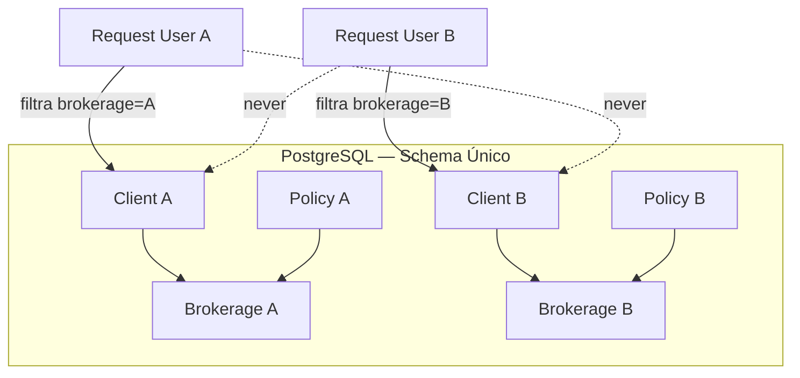
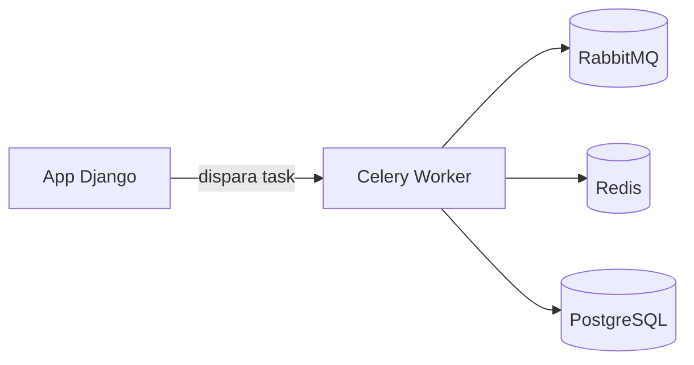
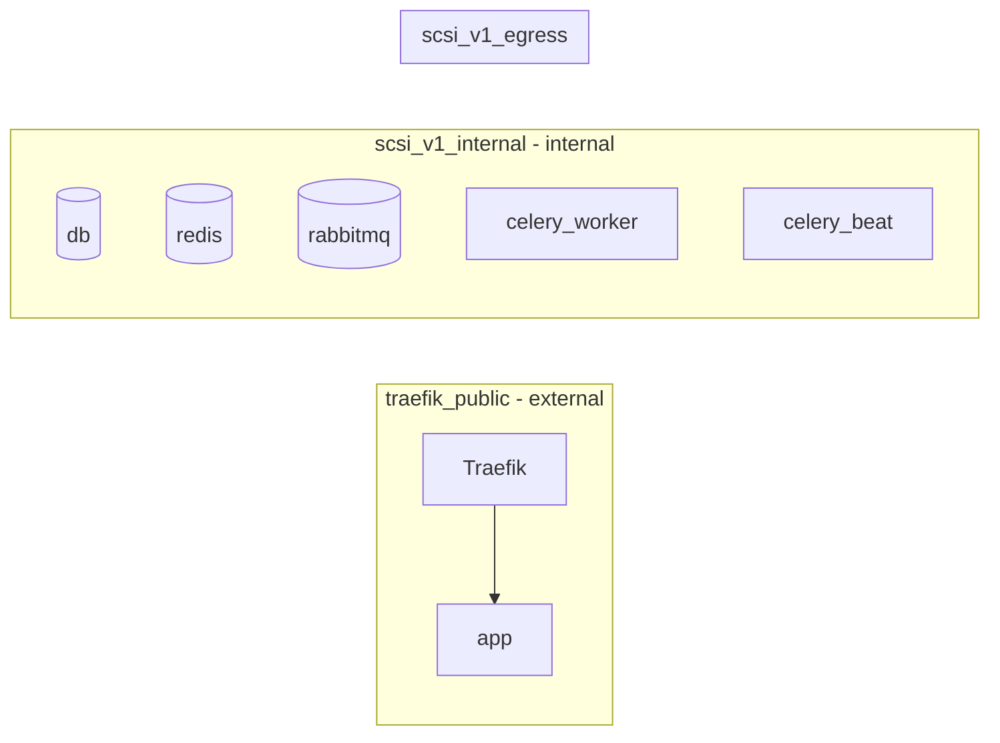

# Arquitetura

## Multi-tenant compartilhado

O SCSI usa arquitetura multi-tenant **compartilhada** (mesmo banco, mesmo schema).
O isolamento é feito pelo campo-chave `brokerage` (FK para `core.Brokerage`) nos
models sensíveis, com filtros obrigatórios via `TenantManager`, middleware de
tenant e validação em forms/admin.

## Apps Django

| App | Responsabilidade |
|---|---|
| `core` | settings, urls, custom user, Brokerage, middleware, healthcheck |
| `base` | models base, tenant manager, mixins, context processors, notificações |
| `accounts` | onboarding de corretora, login |
| `clients` | clientes + anexos |
| `insurers` | seguradoras e ramos |
| `policies` | propostas, apólices, coberturas, itens, endossos, anexos |
| `claims` | sinistros + anexos |
| `crm` | pipelines, etapas, negociações (grid/kanban) |
| `renewals` | renovações |
| `agents` | agentes e produtores |
| `commissions` | comissões e repasses |
| `reports` | relatórios PDF/CSV |
| `dashboard` | dashboard e métricas |
| `ai` | resumos, chat, tasks Celery |

## Tarefas assíncronas

Processamentos pesados (resumos de IA) rodam via Celery para não bloquear a
interface. Ao concluir, criam uma notificação interna.

## Redes Docker (produção)

