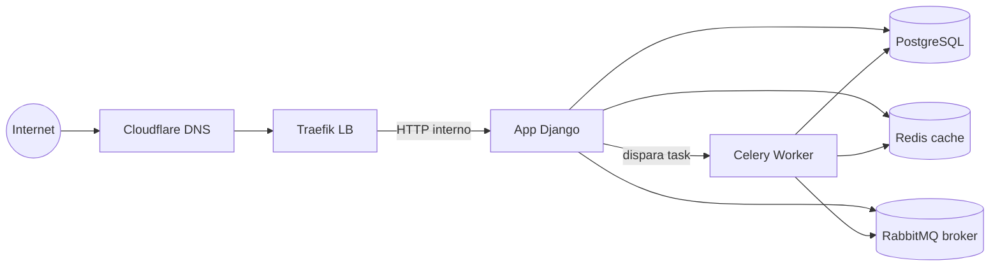

# SCSI

**Sistema de Gestão para Corretora de Seguros Inteligente**

Plataforma SaaS multi-tenant para corretoras de seguros, com CRM, propostas,
apólices, sinistros, renovações, comissões, relatórios, dashboard e agentes de IA.

## Stack

- **Backend:** Django 6 · Python 3.13
- **Banco:** PostgreSQL
- **Tarefas assíncronas:** Celery + RabbitMQ
- **Cache/backend:** Redis
- **IA:** LangChain/LangGraph + OpenAI (com fallback simulado)
- **Container:** Docker Compose (local) · Docker Swarm (produção)
- **Proxy/TLS:** Traefik + Let's Encrypt (DNS-01 Cloudflare)

## Início rápido (local)

```bash
docker compose up
# ou, sem Docker:
python -m venv .venv && source .venv/bin/activate
pip install -r requirements.txt
python manage.py migrate
python manage.py load_fake_data
python manage.py runserver
```

Acesse `http://localhost:8000`.

## Diagrama



Veja as seções [Instalação](instalacao.md), [Arquitetura](arquitetura.md),
[Deploy](deploy.md) e [Uso](uso.md).
